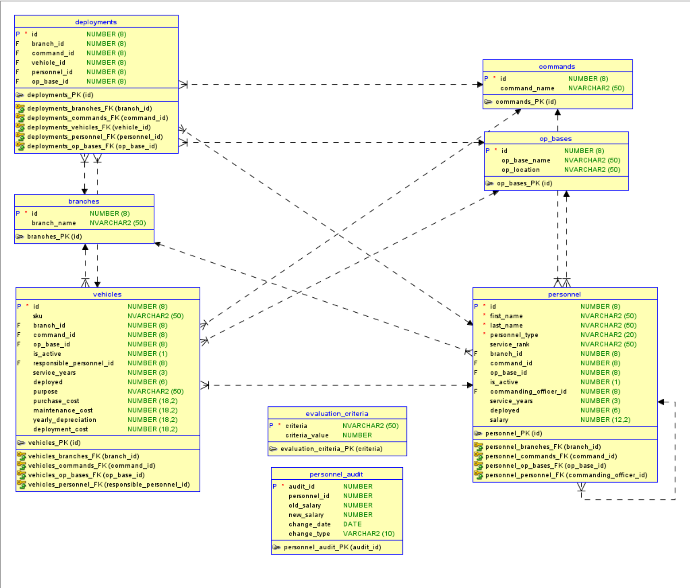

# MILITARY ASSETS DATABASE

Author: Anh Hoang Nguyen

Final Project 420-BD2-AS

Fall 2025

## Too Long; Didnt Read

### Data Model



### Procedures

- add_personnel(p_first_name varchar2, p_last_name varchar2, p_personnel_type varchar2, p_service_rank varchar2, p_branch_id number, p_command_id number, p_op_base_id number, p_salary number)
- add_vehicle(p_sku varchar2, p_branch_id number, p_command_id number, p_op_base_id number, p_responsible_personnel_id number, p_purpose varchar2, p_purchase_cost number)
- create_deployment(p_branch_id number, p_command_id number, p_vehicle_id number, p_personnel_id number, p_op_base_id number)
- get_personnel_by_branch(p_branch_id number)
- calc_vehicle_costs_by_branch(p_branch_id number)
- update_personnel_salary(p_personnel_id number, p_new_salary number)
- deactivate_personnel(p_personnel_id number)
- get_deployment_summary()
- get_all_personnel_correlated()
- get_all_personnel_no_co()

### Functions

- get_branch_total_cost(p_branch_id number) return number
- get_rank_level(p_rank varchar2) return number
- check_deployment_eligibility(p_personnel_id number) return varchar2

### Packages

- pkg_military_ops:
  * generate_deployment_report(p_branch_id number)
  * calculate_readiness_score(p_command_id number) return number
  * optimize_resource_allocation()

### Triggers

- trg_personnel_audit (after update on personnel)
- trg_vehicle_maintenance (before update on vehicles)
- trg_deployment_validation (before insert on deployments)


## OVERVIEW

This database is modeled to store military assets data for
managing resources across US armed force service branches.

I was about to do VN Armed Forces but the organizational
structure is a pain to model. One might get the taste of
such complexity can visit https://politburo.aaanh.app --
which is simply trying to map out the Central Govt structure
using Closure Table database pattern :)

## BACKGROUND & MOTIVATION

The US armed forces possess a large quantity of active duty
personnel and vehicles that serve a diversed set of roles.

We need to keep track of the various attributes of such
personnel and vehicules to ensure that they are ready to be
deployed, so called "combat and operation readiness", as well
as ensure long-term strategic planning, geopolitically and
financially.

The Department of Defense has created a working group, led by
the Undersecretary of Defense John Doe, to take on this mission
and complete it successfully.

The budget for this Defense IT project is set to be $1 for
1 computer specialist.

## SOLUTION & REQUIREMENTS

The solution is a robust and dynamic database to store such
information. The database needs to easy to administer and
operate. It will also need to ensure data integrity on a
large scale operation.

A SQL database is chosen over other non-SQL solutions because
of the ability to perform complex I/O operations with low
processing overheads.

### Caveats

Instead of using the actual rank system for specific branches,
we're using the Army ranks only to simplify the problem domain.

Example: 
- Navy enlisted rank has Petty Officer vs. Army Sergeant.
- Navy officer rank has Captain, which is equivalent to 
  Army Colonel (O-6) as opposed to the Army Captain (0-3).


## USAGE

### Structure overview

The name of the script files specify in which order each MUST
be executed. This is important when setting up a fresh database.

00-schema.sql - creating tables
01-seed.sql - insert initial data; the data MAY include 
  non-compliant values for business logic to simulate
  real-life errors.
02-procedures.sql
03-functions.sql
04-packages.sql
05-triggers.sql - create triggers that are automatically
  executed when a matching operation event is performed
  (kinda like webhooks now that I think about it)
06-demo.sql - includes executions of said procedures,
  functions, references to packages, and 
  operations that would fire off triggers.
99-reset.sql - nuke the whole thing

### Usage

- Generate non-trivial rows for personnel, vehicles, and deployments

  Copy and paste the output into the 01-seed.sql script.

```sh
java Generator.java
```

- Setup and connect to Docker container

```sh
docker compose up -d
docker exec -it 420-bd2-project-db /bin/bash
```

- Connect to running database

```sh
sqlplus sys/Password123
```

- Setup user

```sql
connect sys/sysadm as sysdba
alter session set container=xepdb1;
drop user c##washington cascade;
create user c##washington identified by dod;
grant connect, resource, create view to c##washington;
alter user c##washington quota 100M on users;
connect c##washington/dod;
```

- Execute seed -> procedures, functions, packages, and triggers.
- Then, try out the functionalities with demo.
