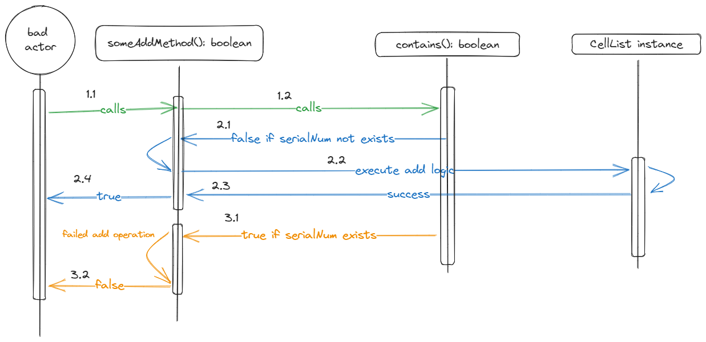

# Security Concerns and Potential Vulnerabilities of the `CellList` implementation as-is and Advisory

By Anh Hoang Nguyen <AnhNguyen@aaanh.com>

GPG Signature: `48AF 7E37 4AEE 898F EE61 EB71 3F93 868E 4C1D F4F8`

## Handled by the JVM

1. **Memory leak** is not a huge concern because dereferenced objects are automatically garbage-collected. Unlike implementations in C and C++ where the developer needs to manually `free()` to deallocate the memory space no longer in used or dereferenced.
2. The explanation can somewhat be applicable also to the case of **Pointer corruption**.

## Potential unmitigated risks by developer

1. **Inference and access control** may be possible where the Bad Actor can have access to the full dataset if the Bad Actor is able to retrieve the `head` attribute of the List without proper access control implementations.
2. **Data corruption** may be possible where the Bad Actor can intentionally delete data by mutating the `next` pointer of any `CellNode` to `null`, destroying the subsequent nodes in the CellList.

## Privacy Leaks

### Methodology

Member attribute and data privacy is achieved through declaring those attributes as `private`. In the case of the inner class `CellNode`, it was made public (inherited from the outer class `CellList`) to make it convenient for development. However, this introduces a vulnerability down the chain.

By design, the implementation of the `CellList` method called `find()` that returns the address of a `CellNode` object in the list instance. An attacker is able to create an arbitrary `CellNode` pointer in the driver method (`CellListUtilization`) in this case to catch that returned address from the `find()` method because the `CellNode` class is public.

### Consequences

With the pointer, the attacker can use the `CellNode` class public methods, such as setters, to modify and corrupt the data. The codeblock below illustrates how the attacker can achieve it.

```java
// Initialize a CellList `cl` to store some important information.
// ...

// Assuming the attack embeds their information through legitimate channels.
// A.k.a. a trojan
// The serial number of the trojan CellNode is 123456
CellNode cn = cl.find(123456);
cn.cell.setPrice("0") // the Cellphone now costs nothing
cn.setNext(null); // Subsequent data stored after this CellNode is destroyed

```

### Mitigations

- Making the inner class `CellNode` constructor `private` -- disallowing users to create a pointer to a `CellNode` object to catch the address returned by the `find()` method
- Making the `find()` method private and only expose `isExist()` to the frontend (which uses `find()` under the hood).

## Brute-force and timing attacks

### Attack vector and methodology

After laying the grounds for potential vulnerability risks, let's take a look at privacy leaks as specified in the assignment documentation.

Right off the bat, we can see a scenario where a privacy leak may occur: usage of any of the adding methods, such as `addToStart(), addAtIndex()` and etc. Because these methods are designed to check if the input serial number is unique before adding the `Cellphone` object inside of a `CellNode` and finally inserting that node into the `CellList`, a Bad Actor may be able to bruteforce and extract information within the `CellList` by continuously inputting any `serialNum`.

See below for an illustration of how this attack based on privacy leak might work.



> Potential Bruteforce Attack Approach &copy; Anh Hoang Nguyen, 2023-11-19.

With that logic at hand, the attacker can simply iterating over and over again to get the `private long serialNum` attribute of the `Cellphone` objects stored in the list.

### Mitigations

While we can certainly mitigate the potential threat by simply modifying our method source code to have a void return instead of boolean, this approach might cause issue further down the road for us when we want to grow the application and debug. Obfuscating whether or not the method succeeds is not the way to go, especially when there is something called "Timing Attack" which measures the time of execution of the method to infer whether or not the method is called successfully.

#### Rate limiter

To mitigate this brute-force approach, we may implement a simple rate limiter, that is, limit the number of any READ or WRITE operation to the `CellList` instance over a period of time. While this rate limiting method does not prevent exfiltration of data, it can discourage the threat actor from going with this approach and possibly overload the compute resources in the process.

In parallel, we would want our authorized and regular users' experience to be affected by the limitation. To achieve this balance between security and convenience, we can implement the rate limiter using the sliding window or leaky bucket algorithm. However, introduction of these algorithms will increase the complexity of our program as we need to cache the operations performed by the user, in addition to implementing the logic.

#### Authentication and Authorization

We can implement a front-end that authenticates the user and then authorizes (gives access permissions) them before any method calls are made.

**Authentication** can be a simple password-based or a token-based approach, while **authorization** can make use of _RBAC_ strategy which allows administrator of the database containing the dataset to enforce _Principle of least privilege (PoLP)_.
